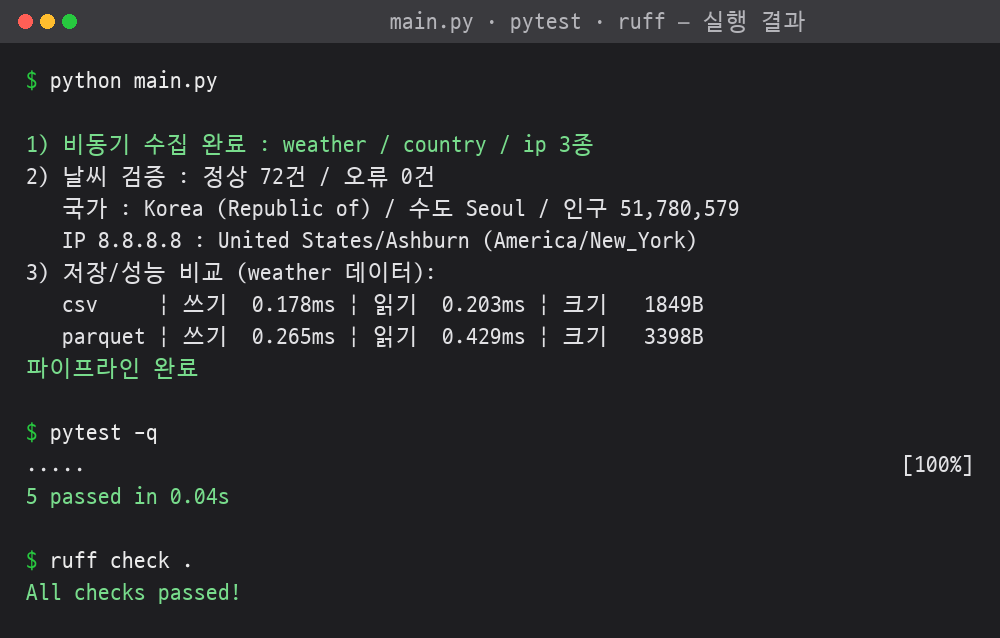

# Day 1 종합 실습 — 수집·검증·저장 파이프라인

- 작성자 : 신주용 (광주 3반)
- 작성일 : 2026-07-20

## 코드 구조
```
광주_3반_신주용_day1종합실습/
├── main.py               # 진입점 (수집 → 검증 → 저장/성능비교)
├── collector.py          # 비동기 API 수집 (asyncio + httpx)
├── models.py             # Pydantic v2 스키마 3종
├── storage.py            # CSV·Parquet 저장 + 성능 측정
├── tests/test_models.py  # 스키마 검증 테스트 (pytest)
├── output/               # 산출물 (weather.csv / weather.parquet)
├── requirements.txt      # 의존성 (버전 고정)
├── pyproject.toml        # ruff·pytest 설정
└── README.md
```

## 설명
- 공개 API 3개를 비동기 동시 수집 → 필요한 필드 추출 → Pydantic v2 로
  타입·범위 검증 → 검증 통과분을 CSV·Parquet 로 저장하고 읽기/쓰기 성능 비교
- 사용 API
  - Open-Meteo : 서울 3일 시간대별 기온·강수확률
  - Countries.dev : 한국 국가 정보
  - ip-api : IP 기반 지역 정보

## 실행 방법
```bash
python3 -m venv .venv
source .venv/bin/activate          # Windows: .venv\Scripts\activate
pip install -r requirements.txt

python main.py     # 파이프라인 실행
pytest -q          # 테스트
ruff check .       # 스타일 검사
```

## 실행 결과


> 날씨·IP 값은 실행 시점마다 달라짐 (실시간 API).
```
1) 비동기 수집 완료 : weather / country / ip 3종
2) 날씨 검증 : 정상 72건 / 오류 0건
   국가 : Korea (Republic of) / 수도 Seoul / 인구 51,780,579
   IP 8.8.8.8 : United States/Ashburn (America/New_York)
3) 저장/성능 비교 (weather 데이터):
   csv     | 쓰기  0.180ms | 읽기  0.199ms | 크기   1849B
   parquet | 쓰기  0.297ms | 읽기  0.469ms | 크기   3398B
파이프라인 완료
```
```
$ pytest -q
.....                                             [100%]
5 passed
```

## 코드 간결화 방법
- 관심사 분리 : 수집·검증·저장을 모듈로 나눠 각 파일을 짧게 유지
- 비동기 동시 호출 : `asyncio.gather` 로 API 3개를 한 번에 (순차 대비 대기 축소)
- 선언적 검증 : Pydantic `Field` 제약(min_length·gt·ge/le)으로 수동 if 검증 제거
- 컴프리헨션 : 시간별 레코드 변환·필드 추출을 `zip` + 딕셔너리 컴프리헨션으로 한 줄 처리
- 중복 제거 : CSV·Parquet 측정을 job 리스트 + 공용 측정 함수 하나로 통일
- 표준·기존 도구 우선 : pathlib·csv·pandas 활용으로 새 코드 최소화
